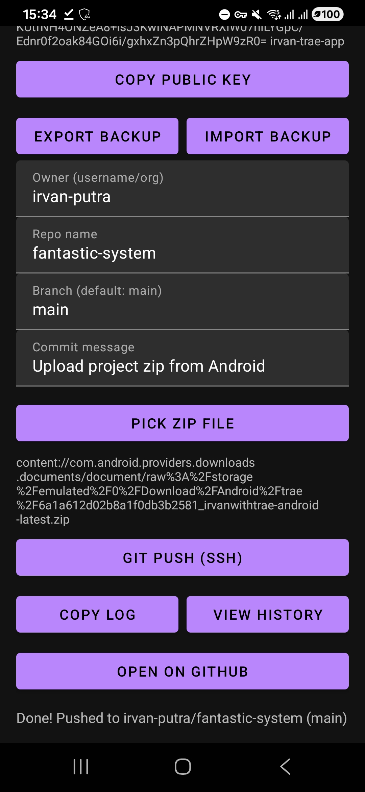

# Irvan Trae (Android)

An Android (Kotlin) app that lets you push a ZIP file to a GitHub repo using real `git` over **SSH**.

## Capabilities

- **Generate SSH key** inside the app and copy the public key for GitHub
- **Push ZIP → GitHub**:
  - Unzips a selected ZIP
  - Creates a commit
  - Pushes to `git@github.com:<owner>/<repo>.git` on the chosen branch
- **Persist settings**
  - Remembers GitHub owner/repo/branch/commit message
  - Keeps the generated SSH key on device
  - Supports Android backup/restore + **Export backup / Import backup**
- **Debugging tools**
  - “Copy log” button for easy paste
  - “View history” screen with full log history + copy/clear
  - Extra diagnostics for push rejections (ahead/behind, remote update status)
- **UI**
  - Home rocket animation
  - Push screen shows a big, slow, front overlay rocket while pushing

## Run on your phone (Android Studio)

1. Open this folder in **Android Studio**
2. Let Gradle sync
3. Connect your Android phone via USB and enable **Developer options → USB debugging**
4. Click **Run ▶** and pick your device

## Build an APK

In Android Studio: **Build → Build Bundle(s) / APK(s) → Build APK(s)**.

## First-time GitHub setup

1. In the app: **Generate SSH key** → **Copy public key**
2. In GitHub: **Settings → SSH and GPG keys → New SSH key**
3. Back in the app: fill owner/repo/branch and push
